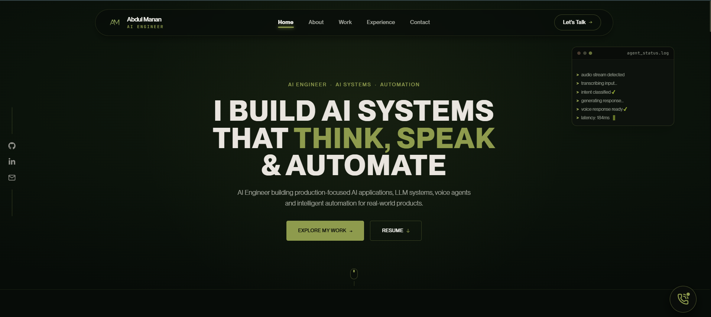
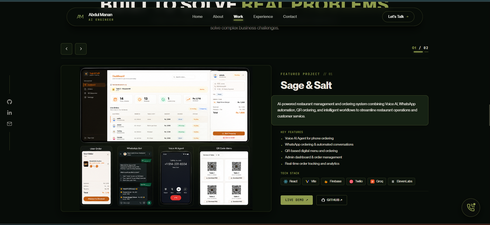
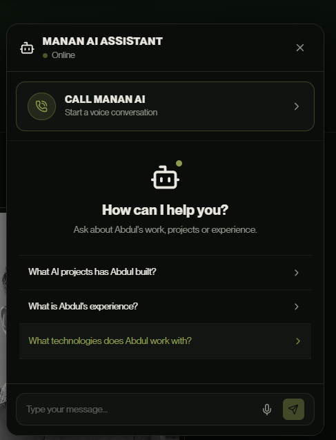
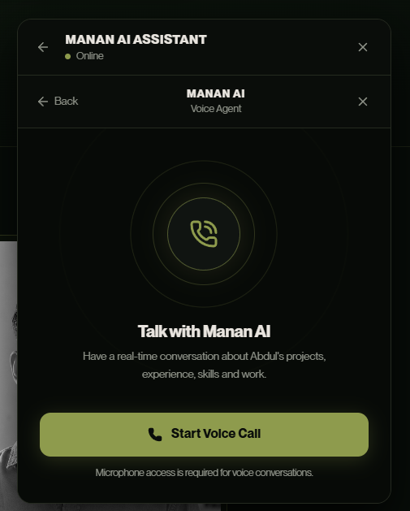

# Abdul Manan — AI Engineer Portfolio

[](https://react.dev/)
[](https://www.typescriptlang.org/)
[](https://vitejs.dev/)
[](https://groq.com/)
[](https://www.retellai.com/)
[](https://vercel.com/)

A modern AI-powered personal portfolio showcasing my work across AI engineering, intelligent applications, voice AI, machine learning, backend development, and automation.

The portfolio goes beyond a traditional static website by including **Manan AI**, an interactive AI assistant that allows visitors to explore my professional background through text, voice notes, and real-time voice conversations.

---

## Preview



*Abdul Manan AI Engineer Portfolio*

### Featured Projects



---

## About the Portfolio

This portfolio was designed as an interactive representation of my work as an AI Engineer.

Visitors can explore:

- Professional experience
- Featured AI projects
- Technical capabilities
- Technology stack
- Education
- Contact information
- AI-powered portfolio assistant
- Voice-note interaction
- Real-time AI voice conversations

The interface is designed to work across desktop, laptop, tablet, and mobile devices.

---

## Manan AI Assistant

Manan AI is an AI-powered portfolio assistant integrated directly into the website.

It is designed to answer questions about my:

- Projects
- Professional experience
- Technical skills
- Education
- AI development work
- Contact information

The assistant uses a structured portfolio knowledge layer as its source of professional information.



### Text Chat

Visitors can communicate with Manan AI using natural-language questions.

The assistant supports conversational context, follow-up questions, informal wording, and common speech or grammar variations.

### Voice Notes

Visitors can record a voice message directly inside the chatbot.

The audio is transcribed through the backend and the resulting query is processed through the same Manan AI conversation system.

The flow is:

`Voice Note` → `Speech-to-Text` → `Manan AI` → `Response`

### Real-Time Voice Agent

The portfolio includes a browser-based real-time AI voice agent powered by Retell AI.

Visitors can start a live voice conversation with Manan AI and ask about my projects, experience, technical background, and work.

The voice interface supports real-time conversation states, microphone control, call termination, and responsive call UI.



---

## Featured Projects

### Sage & Salt

Sage & Salt is an AI-powered restaurant management and ordering platform.

Core capabilities include:

- Voice AI ordering
- WhatsApp automation
- QR-based digital ordering
- Restaurant administration
- Order management
- Real-time analytics

The project combines AI interaction with modern frontend and backend technologies to create an intelligent restaurant workflow.

### Multilingual AI Healthcare

A multilingual AI healthcare assistant combining multiple AI capabilities within a mobile-focused healthcare system.

Core capabilities include:

- AI symptom checking
- Voice interaction
- X-ray analysis
- Pneumonia detection
- Lab report analysis
- OCR
- English and Urdu support
- Activity and health-history functionality

The project combines machine learning, computer vision, OCR, voice interaction, and mobile development.

---

## Technology Stack

### Frontend

- React 19
- TypeScript
- Vite
- Lucide React

### AI and Voice

- Groq (LLM & Whisper Speech-to-Text)
- Retell AI (Real-time Duplex Voice Agent)
- Speech-to-Text
- Voice AI

### Backend

- TypeScript
- Server-side API endpoints
- Express dev server
- Vercel Serverless Functions

### Portfolio Knowledge

Manan AI uses a structured knowledge layer containing professional information about my:

- Profile
- Experience
- Featured projects
- Education
- Technical skills
- Contact information

---

## Architecture

```text
Visitor
    |
    v
React Portfolio
    |
    v
Manan AI Assistant
    |
    +---- Text Message ----> Chat API ------------> Groq (Llama 3.3)
    |
    +---- Voice Note -----> Transcription API ----> Groq (Whisper v3)
    |
    +---- Voice Call -----> Retell Web Call ------> Manan AI Voice Agent
```

Sensitive API credentials are handled server-side and are not intentionally exposed to browser code.

---

## Project Structure

```text
AbdulManan-Portfolio/
├── api/
│   ├── chat.ts           # Serverless endpoint for text chat via Groq
│   ├── transcribe.ts     # Serverless endpoint for voice note STT via Groq
│   └── retell-call.ts    # Serverless endpoint for Retell Web Call session tokens
├── lib/
│   └── mananKnowledge.ts # Structured single source of truth portfolio context
├── server/
│   └── dev-server.ts     # Express server for local development (/api proxy)
├── src/
│   ├── components/       # UI components (FloatingAiWidget, Navbar, Hero, etc.)
│   ├── data/
│   │   └── mananKnowledge.ts  # Re-exports lib/mananKnowledge for frontend backwards compatibility
│   ├── App.tsx           # Main Application entry component
│   └── main.tsx          # Vite React root mounting point
├── public/               # Static assets & pdf documents
│   └── readme/           # README screenshots
│       ├── portfolio-home.png
│       ├── projects.png
│       ├── manan-ai-chat.png
│       └── manan-ai-voice.png
├── .env.example          # Environment variable template with placeholders
├── package.json          # Dependencies and script definitions
└── vite.config.ts        # Vite configuration & /api development proxy
```

---

## Environment Variables

For local development, create `.env.local`:

```env
GROQ_API_KEY=your_groq_api_key
RETELL_API_KEY=your_retell_api_key
RETELL_AGENT_ID=your_retell_agent_id
```

Never commit production credentials or `.env.local`.

The repository includes `.env.example` as a reference.

---

## Local Development

1. Clone the repository:
   ```bash
   git clone https://github.com/MananAli05/AbdulManan-Portfolio.git
   ```

2. Move into the project:
   ```bash
   cd AbdulManan-Portfolio
   ```

3. Install dependencies:
   ```bash
   npm install
   ```

4. Create `.env.local` and configure the required environment variables:
   ```env
   GROQ_API_KEY=your_groq_api_key
   RETELL_API_KEY=your_retell_api_key
   RETELL_AGENT_ID=your_retell_agent_id
   ```

5. Start the local API server:
   ```bash
   npm run dev:api
   ```

6. In another terminal start the frontend:
   ```bash
   npm run dev
   ```

7. Open the local application URL provided by Vite (e.g. `http://localhost:3000`).

---

## Production Deployment

The portfolio is designed for deployment on Vercel.

Production secrets must be configured through Vercel Environment Variables rather than committed to GitHub.

Required production variables:

- `GROQ_API_KEY`
- `RETELL_API_KEY`
- `RETELL_AGENT_ID`

---

## Security

Sensitive credentials are handled through environment variables.

The following must never be committed:

- Groq API keys
- Retell API keys
- `.env.local`
- Production secrets

API credentials used by server-side integrations remain outside the frontend bundle.

---

## Contact

**Abdul Manan**

- Email: [abdulmannan.developer@gmail.com](mailto:abdulmannan.developer@gmail.com)
- GitHub: [https://github.com/MananAli05](https://github.com/MananAli05)
- LinkedIn: [https://linkedin.com/in/abdul-manan05](https://linkedin.com/in/abdul-manan05)

---

## Repository

[https://github.com/MananAli05/AbdulManan-Portfolio](https://github.com/MananAli05/AbdulManan-Portfolio)

---

## License

This portfolio and its source code are maintained by Abdul Manan.
